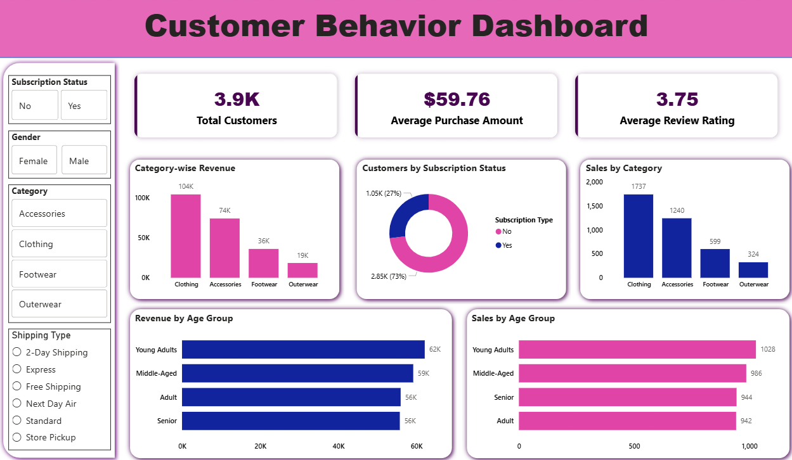

# Customer Shopping Behavior Analysis 📊

An end-to-end Data Analytics project focused on analyzing customer shopping behavior using **Python, MySQL, SQL, and Power BI**. The project workflow includes data cleaning and feature engineering using Python, storing the processed data into a MySQL database, performing SQL-based business analysis, and building an interactive Power BI dashboard for business insights and visualization.

---

# 🚀 Project Workflow

```text
CSV Dataset → Python Data Cleaning → MySQL Database Integration → SQL Analysis → Power BI Dashboard
```

---

# 🛠️ Tools & Technologies Used

- Python
- Pandas
- MySQL
- SQL
- SQLAlchemy
- PyMySQL
- Power BI
- VS Code Jupyter Notebook

---

# 📂 Project Files

```text
customer_behavior_analysis.ipynb
customer_shopping_behavior_analysis.sql
customer_behavior_dashboard.pbix
customer_shopping_behavior.csv
README.md
```

---

# ⚙️ Project Workflow Explained

## 1️⃣ Data Cleaning & Feature Engineering (Python)

Performed using Python and Pandas:

- Loaded dataset using Pandas
- Checked missing values and dataset information
- Filled missing values using category-wise median
- Renamed and formatted columns
- Created `age_group` feature using quartile segmentation
- Converted purchase frequency into number of days
- Removed redundant columns
- Prepared cleaned dataset for database integration

---

## 2️⃣ MySQL Database Integration

- Connected Python with MySQL using SQLAlchemy & PyMySQL
- Uploaded cleaned dataset into MySQL database
- Created structured database table for SQL analysis

---

## 3️⃣ SQL Business Analysis

Performed analytical SQL queries to generate business insights using:

- GROUP BY
- Aggregate Functions
- CASE WHEN
- Subqueries
- CTEs (Common Table Expressions)
- Window Functions
- Ranking Functions
- ORDER BY & LIMIT

---

# 🔍 Key Business Analysis Performed

- Revenue Analysis by Gender
- Customer Segmentation
- Subscription vs Non-Subscription Analysis
- Product Performance Analysis
- Discount Usage Analysis
- Revenue by Age Group
- Shipping Type Analysis
- Repeat Customer Analysis
- Top Customers & Product Insights

---

# 📊 Power BI Dashboard

Connected Power BI directly with the MySQL database to create an interactive business dashboard.

### Dashboard Features

- KPI Cards
- Donut Charts
- Revenue Analysis
- Customer Segmentation
- Product Performance Insights
- Interactive Slicers
- Data Labels
- Interactive Filtering

---

# 📈 Dashboard Preview



---

# 💡 Business Insights Generated

- Identified high revenue-generating product categories
- Compared spending behavior of subscribers vs non-subscribers
- Analyzed customer purchasing patterns
- Detected products with highest discount usage
- Segmented customers into New, Returning, and Loyal groups
- Evaluated customer behavior across different age groups

---

# 🎯 Project Outcome

This project demonstrates a complete end-to-end Data Analytics workflow involving:

- Data Cleaning
- Feature Engineering
- Database Integration
- SQL-Based Business Analysis
- Business Intelligence Dashboarding

The project showcases practical skills required for Data Analyst and Business Analyst roles.

---

# 👨‍💻 Author

## Himanshu

---
